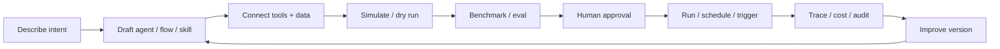

# AgentsKitOS UI Experience Plan

## Product Promise

AgentsKitOS is the friendly control surface for a modular agent ecosystem. It
must feel simple enough for a clinic operator or marketing coordinator to run a
workflow, and precise enough for an engineering team to orchestrate SDLC agents,
benchmarks, triggers, policies, traces, and configuration files.

The UI is not the product by itself. The UI is the final, natural expression of:

1. AgentsKit primitives.
2. OS contracts and headless behavior.
3. Domain templates.
4. Governance, observability, and cost control.
5. Human-friendly orchestration.

If the UI needs a paragraph to explain what to do next, the UI failed.

Visual execution is governed by [UI-VISUAL-SYSTEM.md](./UI-VISUAL-SYSTEM.md).
Implementation discipline is governed by
[UI-FRONTEND-GUARDRAILS.md](./UI-FRONTEND-GUARDRAILS.md). These are part of the
product plan, not optional polish.

## Design Thesis

The interface should feel like an **agent operations cockpit that starts as a
conversation**.

New users should see one obvious action: ask, import, or start from a template.
Power users should never feel slowed down: command palette, keyboard shortcuts,
split views, config round-trip, and multi-monitor control must be first-class.

The same system needs three access layers:

| Layer | User mental model | Primary UI |
|---|---|---|
| Guided | "I need this task automated." | Chat, templates, plain-language forms |
| Builder | "I want to shape the workflow." | Visual flows, agent cards, integration hub |
| Operator | "I need control and evidence." | Runs, traces, benchmarks, evals, policies, config |

## What Is Wrong With The Current Direction

The current plan is broad but not yet coherent enough. It risks becoming a
sidebar full of future modules where every screen repeats the same pattern:
summary cards, table, detail panel, preview data.

Main issues:

- Navigation mirrors internal packages more than user intent.
- Too many primary sidebar destinations compete for attention.
- Creation flows are not central enough. AgentsKitOS should help users create
  agents, skills, flows, triggers, RAG, and integrations before asking them to
  manage empty registries.
- Beginner and power-user paths are mixed instead of layered.
- "Preview" surfaces make the app feel like a prototype instead of a working
  OS.
- Benchmark, eval, traces, cost, and security are separate screens, but in real
  work they are evidence attached to flows, runs, and agents.
- There is no single "build loop" that makes the ecosystem feel logical:
  Describe → Generate → Inspect → Run → Compare → Approve → Operate.

## North Star Interaction Loop

Every feature should fit this loop:



If a screen does not support at least one step in this loop, it should not be a
primary surface.

## Information Architecture

### Primary Navigation

Keep the main sidebar short. Primary nav should represent work modes, not every
module.

| Primary item | Purpose | Contains |
|---|---|---|
| Home | What needs attention now | active runs, approvals, broken triggers, cost warnings, next recommended actions |
| Build | Create and edit automations | chat builder, visual flows, agents, skills, templates, RAG/data |
| Operate | Run and monitor work | runs, schedules, triggers, HITL, incidents |
| Evaluate | Improve quality | benchmarks, evals, model comparisons, replay, regression history |
| Govern | Keep it safe | policies, security, cost, audit, vault, compliance |
| Marketplace | Extend the system | integrations, skills, templates, plugins |

### Secondary Access

These should be reachable through tabs, contextual panels, search, and command
palette, not necessarily always visible in the sidebar:

- Agents
- Skills
- Flows
- Triggers
- RAG/data sources
- Integrations
- Runs
- Traces
- Evals
- Benchmarks
- Cost
- Security
- Audit
- Config
- Workspaces

### Power User Access

Power users should have direct access without bloating the beginner UI:

- Command palette with verbs: `Create agent`, `Run flow`, `Compare providers`,
  `Open config`, `Replay trace`, `Install integration`.
- Keyboard shortcut map.
- Split views and multi-monitor windows.
- Raw config editor with diff/validate/explain.
- Deep links to every object: flow, run, trace, agent, skill, integration.

## Object Model In The UI

The UI should revolve around a small set of visible objects:

| Object | User wording | Technical backing |
|---|---|---|
| Workspace | "My team/client/project" | `WorkspaceConfig` |
| Agent | "Worker with a role" | AgentsKit adapter/runtime + OS agent config |
| Skill | "Reusable capability/persona" | AgentsKit skills + marketplace metadata |
| Flow | "Automation made of steps" | `os-flow` DAG |
| Trigger | "When this starts" | trigger provider contract |
| Integration | "Connected app/tool/data" | AgentsKit tools/MCP/plugin |
| Run | "One execution" | headless runner + trace |
| Evidence | "Why can I trust this?" | traces, evals, audit, cost, policy |

Every screen should make these relationships visible. For example, a flow detail
should show its agents, skills, triggers, integrations, last run, eval status,
cost policy, and audit state in one coherent view.

## Core Screens

### 1. Home

Goal: answer "What is happening and what should I do next?"

Must show:

- Current workspace.
- Active runs.
- Pending approvals.
- Broken triggers/integrations.
- Cost or policy warnings.
- Recent useful outcomes.
- One primary action: `Create automation`.

Do not show:

- Decorative metrics without an action.
- Long tables.
- Preview badges.

### 2. Build

Goal: make creation obvious.

Default entry: a chat-like builder that can create:

- Agent.
- Skill.
- Flow.
- Trigger.
- RAG/data source.
- Benchmark.
- Integration.

Builder output should always become an editable object, never a dead chat
answer.

Build tabs:

- `Ask` — natural language builder.
- `Templates` — domain starters.
- `Flows` — visual editor and registry.
- `Agents` — agent registry and creation.
- `Skills` — skill/persona library.
- `Data` — RAG/data sources.

### 3. Flow Detail

This is the most important object page. It should combine visual simplicity with
operational depth.

Required sections:

- Visual canvas.
- Plain-language summary.
- Trigger.
- Agents/skills used.
- Integrations/tools used.
- Data/RAG sources.
- Run mode and policy.
- Last runs.
- Eval and benchmark status.
- Cost projection.
- Audit/security state.
- Config view/diff.

Default mode should be readable. Advanced mode reveals node-level config,
schemas, retry policy, sandbox, and raw YAML/TS.

### 4. Agent Detail

Goal: make an agent understandable as a worker.

Required sections:

- Role and instructions.
- Provider/model/CLI binding.
- Skills.
- Tools/integrations.
- RAG/data access.
- Permissions.
- Cost and quality history.
- Recent runs.
- Version history.
- Benchmark against alternatives.

Creation should support both:

- "Create from description."
- "Create from config."

### 5. Integration Hub

Goal: connect capabilities without exposing package complexity.

Organize by user outcome:

- Communication: Slack, Discord, Teams, email.
- Dev: GitHub, Linear, CI, repos.
- Data/RAG: files, Notion, Confluence, Postgres, S3.
- Marketing: HubSpot, Google Drive, social tools.
- Clinical/Ops: EHR connectors later, secure document ingestion, approvals.
- MCP: discovered local servers and installable servers.

Each integration card should answer:

- What can it do?
- What permission does it need?
- Which flows use it?
- Is it healthy?
- What will it cost/risk?

### 6. Operate

Goal: run the business/process safely.

Contains:

- Runs queue.
- Trigger health.
- HITL inbox.
- Incidents.
- Schedules.

This is where non-technical users should spend time after setup.

### 7. Evaluate

Goal: improve quality without requiring ML expertise.

Contains:

- Benchmarks: same task across providers/agents/models.
- Evals: regression suites and rubric scoring.
- Replay: rerun from trace.
- Comparisons: cost, time, completeness, tests, human rating.

Benchmarks should attach to agents and flows, not live as isolated reports.

### 8. Govern

Goal: keep the system safe and accountable.

Contains:

- Cost quotas.
- Workspace policies.
- Permissions/RBAC.
- Audit log.
- Vault/secrets.
- PII/RAG privacy.
- Compliance exports.

Use plain language first: "This flow can post to Slack but cannot write files."
Advanced users can open the exact policy rule.

## Creation Flows

### Create Automation

One entrypoint, multiple outputs:

1. User describes outcome.
2. OS asks only missing critical questions.
3. OS proposes flow + agents + triggers + integrations + data.
4. User can run simulation.
5. User reviews cost/risk.
6. User approves/schedules.

### Create Agent

Minimum fields:

- Name.
- Role.
- Provider/model.
- Skills.
- Tools/integrations.
- Data access.
- Permissions.

Advanced fields:

- System instructions.
- Sandbox.
- Cost budget.
- Eval suite.
- Versioning.
- Fallback/ensemble config.

### Create Skill

Minimum fields:

- Name.
- What it helps with.
- Instructions/persona.
- Inputs/outputs.
- Example tasks.

Advanced fields:

- Required tools.
- Domain constraints.
- Evaluation rubric.
- Marketplace metadata.

### Create Benchmark

Minimum fields:

- Task.
- Candidates.
- Success rubric.

Output:

- Completeness.
- Cost.
- Duration.
- Tokens.
- Tests/evals.
- Recommendation with evidence.

## Progressive Disclosure Rules

1. Show the next action, not every option.
2. Details live beside the object, not in unrelated pages.
3. Advanced config is always available, but never required for happy path.
4. Empty states should offer creation, import, or template.
5. Tables are for scanning; object pages are for understanding.
6. Metrics must be actionable or contextual.
7. "Preview data" is forbidden in production user flows.

## Navigation Rules

Primary sidebar maximum: 6 items.

Contextual tabs maximum: 7 tabs.

If a module does not answer a top-level user question, it belongs under:

- object detail,
- command palette,
- settings,
- marketplace,
- or advanced config.

## Visual Language

AgentsKitOS should feel:

- calm,
- precise,
- trustworthy,
- fast,
- quietly powerful.

Avoid:

- decorative glass everywhere,
- too many cards,
- dense sidebars,
- repeated metric tiles,
- internal jargon as labels,
- glowing cyber UI as the dominant personality.

Prefer:

- clear object hierarchy,
- dense but readable operator surfaces,
- strong empty states,
- meaningful icons,
- subtle motion for state changes,
- consistent split-pane object detail,
- progressive disclosure.

## Implementation Roadmap

### Phase UI-0 — Stop The Chaos

Goal: make the shell coherent before adding more surfaces.

- Replace current sidebar with the 6-mode IA.
- Move secondary modules under mode tabs.
- Remove production `Preview data` labels.
- Standardize object detail layout.
- Define route contracts for every object type.
- Keep command palette as universal access.

Exit criteria:

- A new user can answer "where do I create an automation?"
- A power user can open any old screen through search/palette.
- No new screen can ship without typed contract + empty/loading/error states.

### Phase UI-1 — Creation First

Goal: make AgentsKitOS useful before the user understands the whole system.

- Build `Create automation` flow.
- Build `Create agent` flow.
- Build `Create skill` flow.
- Build `Connect integration` flow.
- Build template-based starts for SDLC, marketing, clinic ops.

Exit criteria:

- Time to first useful dry run under 3 minutes.
- Every created object is editable in visual and config modes.

### Phase UI-2 — Flow-Centric Operating Model

Goal: make flows the central object tying the ecosystem together.

- Flow detail page becomes the central hub.
- Attach agents, triggers, integrations, RAG, evals, benchmarks, runs, cost,
  security, and audit to flow detail.
- Add visual canvas + plain-language summary + raw config.

Exit criteria:

- A flow can be understood, tested, scheduled, audited, and improved from one
  page.

### Phase UI-3 — Operator Workbench

Goal: support daily use.

- Home action feed.
- Operate queue.
- HITL decision inbox.
- Trigger health.
- Incident states.
- Notification rules.

Exit criteria:

- Non-technical users can run and supervise workflows without opening config.

### Phase UI-4 — Advanced Control

Goal: support engineering teams and power users.

- Split views.
- Multi-monitor layouts.
- Config editor with validate/explain/diff.
- Keyboard-first shortcuts.
- Trace replay and fork-to-flow.
- Benchmark/eval workbench.

Exit criteria:

- Advanced users can operate faster through keyboard/config than through forms.

### Phase UI-5 — Marketplace As Growth Layer

Goal: make the ecosystem extensible without making core UI chaotic.

- Integration hub.
- Skills marketplace.
- Templates marketplace.
- Plugin marketplace.
- Verified/security labels.
- Install-to-flow flow.

Exit criteria:

- New capabilities enter through Marketplace/Build, not new permanent sidebar
  items.

## Screen Contract Template

Every screen or object page needs:

```md
## Surface
Name:
Primary user:
Primary job:
Entry points:
Empty state action:

## Objects
Reads:
Writes:
Related objects:

## Contracts
Headless method:
IPC DTO:
Zod schema:
Config path:

## States
Loading:
Empty:
Ready:
Error:
Permission denied:
Offline:

## Power User
Command palette actions:
Keyboard shortcuts:
Deep links:
Config round-trip:

## Evidence
Trace events:
Audit events:
Cost events:
Eval/benchmark hooks:
```

## Immediate Refactor Targets

1. **Shell IA:** collapse sidebar into Home, Build, Operate, Evaluate, Govern,
   Marketplace.
2. **Build landing:** create the first creation-oriented surface.
3. **Flow detail:** make it the central page for orchestration evidence.
4. **Object detail standard:** one pattern for agent, flow, trigger,
   integration, run.
5. **Remove prototype tells:** no preview badges, no hidden fixture language, no
   unexplained internal names.
6. **Typed UI clients:** replace screen-local `sidecarRequest<unknown>` with
   typed clients per object.

## Definition Of Done For UI Work

- Beginner path exists.
- Power-user path exists.
- Screen has typed data contract.
- Screen has empty/loading/error/permission/offline states.
- Screen is responsive by design, not only by shrinking.
- Screen supports keyboard navigation.
- Screen is connected to command palette.
- Screen has at least one meaningful action.
- Screen does not add a primary nav item unless it is a work mode.
- Screen can be explained by its layout without helper text.
